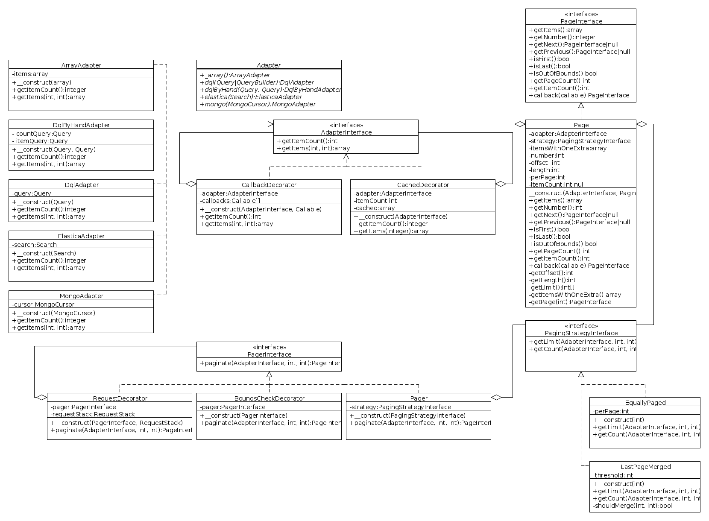

Documentation
-------------

### Table of Contents

* [Adapters](#adapters)
* [Strategies](#strategies)
* [Callbacks](#callbacks)
* [Avoid expensive counting](#avoid-expensive-counting)
* [Bounds checking](#bounds-checking)
* [Symfony bundle](#symfony-bundle)
  * [Installation](#installation)
  * [Usage](#usage)
  * [Configuration](#configuration)
* [Class diagram](#class-diagram)

### Adapters

Adapters are used to allow paging of specific types of items. The following
are supported out of the box:

* [`ArrayAdapter`](/src/Adapter/ArrayAdapter.php)
* [`DqlAdapter`](/src/Adapter/DqlAdapter.php)
* [`DqlByHandAdapter`](/src/Adapter/DqlByHandAdapter.php)
* [`ElasticaAdapter`](/src/Adapter/ElasticaAdapter.php)
* [`MongoAdapter`](/src/Adapter/MongoAdapter.php)

A single [`Adapter`](/src/Adapter.php) can be used to construct any of the
adapters from within a single class.

```php
<?php

$pager->paginate(Adapter::_array(['foo', 'bar', 'baz']));

?>
```

### Strategies

Strategies define the way items are split to pages. By default the "equally
paged" strategy is used.

```php
<?php

use KG\Pager\Pager;
use KG\Pager\Strategy\EquallyPaged;
use KG\Pager\Strategy\LastPageMerged;

$pagerA = new Pager(new EquallyPaged());
$pagerB = new Pager(new LastPageMerged(0.3333));

?>
```

The following strategies exist:

- [`EquallyPaged`](/src/Strategy/EquallyPaged.php) - split items equally
  between the pages;
- [`LastPageMerged`](/src/Strategy/LastPageMerged.php) - split items equally
  between the pages, but merge the last two pages if there are too few items
  left dangling on the last page;

### Callbacks

Callbacks are used to modify paged items. They're added to page objects and
are applied whenever the items are fetched for the first time. The only
requirement is that the callback must return exactly as many items as were
passed to it.

Each callback constructs a new `Page` object so you can keep multiple pages
around.

```php
<?php

use KG\Pager\Pager;
use KG\Pager\Adapter\ArrayAdapter;

$pager = new Pager();
$page = $pager
    ->paginate(new ArrayAdapter(array(1, 2)))
    ->callback(function (array $items) {
        foreach ($items as $key => $item) {
            $items[$key] = $item * 2;
        }

        return $items;
    })
;

$page->getItems(); // [2, 4]

?>
```

### Getting items from all of the pages

Sometimes it might be necessary to keep using the paging system yet fetch all
items from all of the pages.

```php
<?php

use KG\Pager\Pager;
use KG\Pager\Adapter\ArrayAdapter;

$perPage = 2;
$pager = new Pager();
$page = $pager->paginate(new ArrayAdapter(range(0, 3)), $perPage);

$page->getItems(); // [0, 1]
$page->getItemsOfAllPages(); // [0, 1, 2, 3]

?>
```

### Avoiding expensive counting

On bigger result sets it might be prohibitively expensive to count the total
number of items. The pager won't use adapter's count method by sticking to the
following methods:

    - Page::getNext()
    - Page::getPrevious()
    - Page::isFirst()
    - Page::isLast()
    - Page::isOutOfBounds()
    - Page::getItems()
    - Page::getNumber()
    - Page::callback()

This guarantee only applies when using built-in strategies and adapters.

### Automatically setting the current page

The [symfony/http-foundation](https://packagist.org/packages/symfony/http-foundation)
package is required for this feature. The pager can be wrapped by a special
decorator, which gets the current page automatically from the given request.

```php
<?php

use KG\Pager\Pager;
use KG\Pager\RequestDecorator;

// Given http://example.com?page=3 & assuming there's a Symfony Request object
// in the RequestStack object.
$pager = new RequestDecorator(new Pager(), $requestStack);
$page = $pager->paginate($adapter);

$page->getNumber() // 3

?>
```

### Bounds checking

Bounds checking is disabled by default. This can be checked manually any time
by calling `Page::isOutOfBounds()`. However, this requires knowing the total
count of items.

The pager can be wrapped in a [`BoundsCheckDecorator`](/src/BoundsCheckDecorator.php)
to throw exceptions for out of bounds pages.

```php
<?php

use KG\Pager\BoundsCheckDecorator;
use KG\Pager\Exception\OutOfBoundsException;
use KG\Pager\Pager;

$pager = new BoundsCheckDecorator(new Pager(), 'custom_key');

try {
    $pager->paginate($adapter, null, -5);
} catch (OutOfBoundsException $e) {
    // Location: http://example.com?custom_key=1
    header(sprintf('Location: http://example.com?%s=%s', $e->getRedirectKey(), 1));
}

?>
```

### Symfony bundle

The package comes with a bundle to seamlessly integrate with your Symfony
projects.

#### Installation

After installing the package, simply enable it in the kernel:

```php
<?php
// app/AppKernel.php

public function registerBundles()
{
    $bundles = array(
        // ...
        new KG\Pager\Bundle\KGPagerBundle(),
    );
}
?>
```

That's it! no extra configuration necessary. You can make sure the bundle's up
and running by executing

```bash
app/console container:debug | grep kg_pager
```

If everything's working, it should print out the pager service.

#### Usage

By default a single pager is defined. Access it through the `kg_pager` service id.
The current page is inferred from the `page` query parameter.

```php
<?php

use KG\Pager\Adapter;
use Symfony\Bundle\FrameworkBundle\Controller\Controller;

class AcmeDemoController extends Controller
{
    public function listPagedAction()
    {
        $qb = $this
            ->getDoctrine()
            ->getRepository('AppBundle:Product')
            ->createQueryBuilder('p')
        ;

        // 25 items per page is used by default.
        $itemsPerPage = 10;
        $page = $this->get('kg_pager')->paginate(Adapter::dql($qb), $itemsPerPage);

        return $this->render('App:Product:listPaged.html.twig', array(
            'page' => $page
        ));
    }
}

?>
```

Of course the pager can also be injected to any service.

```php
<?php

use KG\Pager\Adapter;
use KG\Pager\PagerInterface;

class ExampleService
{
    private $pager;

    public function __construct(PagerInterface $pager)
    {
        $this->pager = $pager;
    }

    public function doSomethingPaged()
    {
        $list = array('foo', 'bar', 'baz');

        return $this->pager->paginate(Adapter::_array($list), 2);
    }
}

?>
```

```xml
<service id="example_service" class="Acme\ExampleService">
    <argument type="service" id="kg_pager" />
</service>
```

#### Configuration

You may want to optinally configure the bundle to define several pagers, each
with their own settings.

```yaml
kg_pager:
    default: foo              # now `kg_pager` returns a pager named `foo`
    pagers:
        foo:
            per_page: 20      # how many items to have on a single page
            key: custom_page  # the key used to infer the current page i.e. `http://exapmle.com?custom_page=2`
            merge: 10         # if less than 10 items are left on the last page, merge it with the previous page
            redirect: false   # whether to redirect the user, if they requested an out of bounds page
        bar: ~                # pager with default settings
```

The pagers are registered in the service container as `kg_pager.pager.%name%`
with the default pager aliased to `kg_pager`.

You may optionally want to have the default pager be automatically injected to
your entity repositories. For this do the following:

 * Have a custom repository class implement [`PagerAwareInterface`][Doctrine/PagerAwareInterface.php];
 * Set the class as the default repository class and add a custom factory service
   in doctrine configuration:

   ```yml
   // app/config/config.yml
   doctrine:
       orm:
           default_repository_class: 'Repository\Implementing\PagerAwareInterface'
           repository_factory: 'kg_pager.pager_aware_repository_factory'

   ```

### Class diagram


